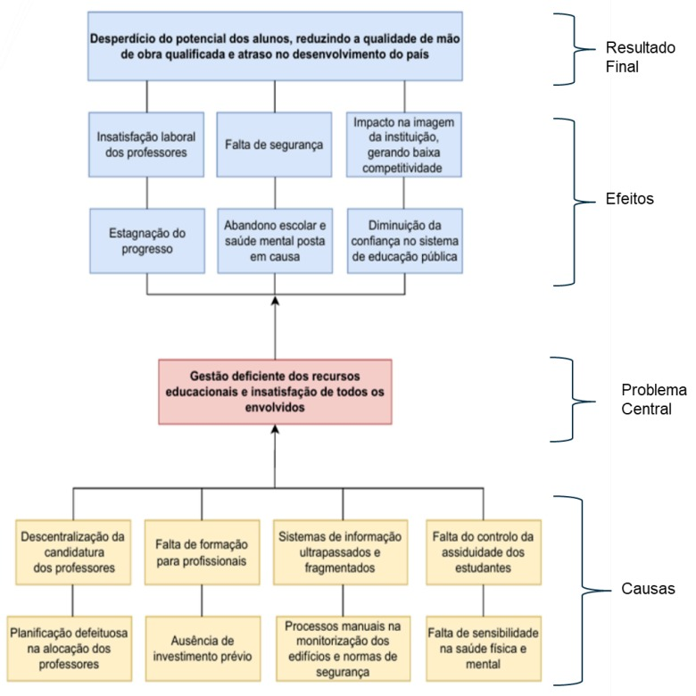
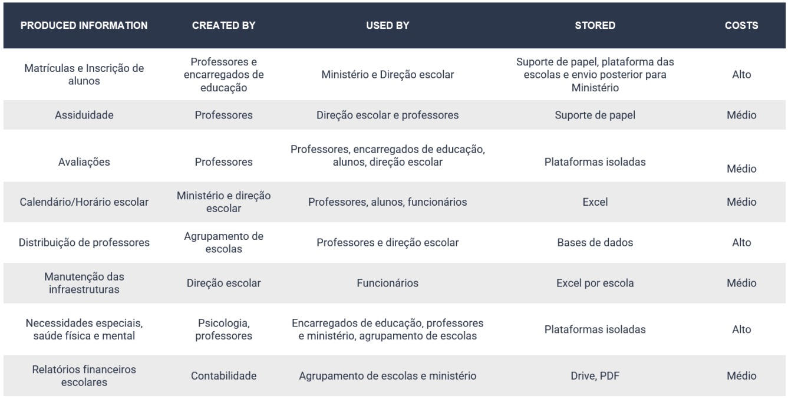
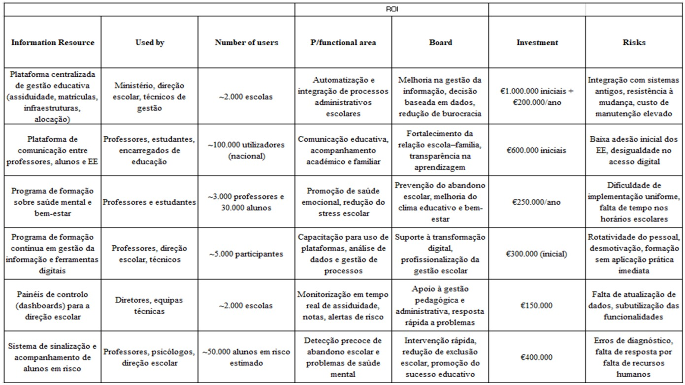

# Public Education Information Management

Case study on information management, data governance and decision-support for the Portuguese public education system.

## Overview

This repository presents an academic case study focused on information management and digital transformation in the Portuguese public education system.

The project analyzes how fragmented information systems, manual processes and limited data-driven decision-making can affect the efficiency, transparency and quality of public education. It proposes an integrated information management framework to support better resource allocation, operational monitoring, risk analysis and strategic decision-making.

The main focus of this work is not dashboard development, but rather the design of an information management approach for a large-scale public sector context.

## Project Context

The Portuguese public education system operates across multiple organizational levels, including schools, school clusters and central public administration. Managing information across this structure creates challenges related to data fragmentation, manual workflows, inconsistent monitoring and limited real-time visibility.

This project was developed as part of an academic assignment in the B.Sc. in Artificial Intelligence and Data Science at the Faculty of Sciences, University of Porto.

## Problem Statement

The project identifies several information management challenges in the public education system:

- Fragmented and disconnected information systems
- Inefficient teacher allocation processes
- Limited monitoring of school infrastructure conditions
- Insufficient integration of student support services
- Dependence on manual or semi-digital administrative processes
- Lack of professional training in modern information management practices
- Limited use of data for operational and strategic decision-making

These issues can negatively affect operational efficiency, educational quality, student well-being, infrastructure planning and public trust in the education system.

## Proposed Solution

The proposed solution is based on the creation of a unified digital platform for integrated school process management.

The platform would support:

- Centralized management of student attendance and enrollment data
- More efficient teacher allocation based on available information
- Infrastructure monitoring and maintenance planning
- Integrated student support and well-being tracking
- Improved communication between schools, students, teachers and families
- Data-driven monitoring and decision-support processes

The proposal also includes professional training, phased implementation through pilot projects and compliance with data protection requirements such as GDPR.

## Methodology

The project follows an information management and problem-solving approach, including:

1. **Problem Diagnosis**  
   Identification of key operational and information-related challenges using a problem tree and diagnostic InfoMap.

2. **Information Mapping**  
   Analysis of produced information, responsible actors, users, storage formats and associated costs.

3. **Solution Design**  
   Proposal of an integrated digital platform and supporting organizational processes.

4. **Implementation Planning**  
   Definition of pilot projects, training activities, milestones and national deployment considerations.

5. **Risk Analysis**  
   Evaluation of risks associated with both implementation and non-implementation of the proposed solution.

6. **Decision-Support Perspective**  
   Focus on how better information management can support strategic decisions in public education.

## Key Components

### Information Management

The project emphasizes the importance of centralized, reliable and accessible information for improving decision-making across the education system.

### Data Governance

The proposal considers privacy, confidentiality and data protection as essential requirements, particularly due to the sensitive nature of student, teacher and family data.

### Operational Monitoring

The solution supports monitoring of processes such as teacher allocation, attendance, infrastructure conditions and student well-being.

### Risk Management

The project includes risk analysis related to inefficient processes, system fragmentation, implementation challenges and the potential consequences of not modernizing current information systems.

### Strategic Decision Support

The proposed framework aims to help public education stakeholders make more informed decisions regarding resource allocation, infrastructure investment and student support services.

## Project Visuals

### Problem Tree

The problem tree summarizes the main causes, central problem, effects and final outcome associated with inefficient information management in the Portuguese public education system.



### Diagnostic InfoMap

The diagnostic InfoMap maps key information resources, responsible actors, users, storage formats and associated costs across the education system.



### Investment InfoMap

The investment InfoMap connects proposed information resources with target users, expected value, required investment and implementation risks.



## Repository Contents

```text
public-education-information-management/
│
├── README.md                         # Project overview and documentation
├── report.pdf                        # Full academic report
├── presentation.pdf                  # Final project presentation
└── assets/
    ├── problem-tree.jpeg              # Problem diagnosis: causes, central problem, effects and final outcome
    ├── diagnostic-infomap.jpeg        # Diagnostic InfoMap: information resources, actors, users, storage and costs
    ├── objectives-tree.jpeg           # Objectives tree: expected results, general objective and specific objectives
    ├── investment-infomap.jpeg        # Investment InfoMap: proposed resources, users, value, investment and risks
    ├── implementation-timeline.jpeg   # Implementation timeline and project milestones
    ├── non-implementation-risks.jpeg  # Risk table for the non-implementation scenario
    ├── implementation-risks.jpeg      # Risk table for the implementation scenario
    ├── risk-matrix.jpeg               # Risk matrix comparing implementation and non-implementation exposure
    └── dashboard-demo.mp4            # Optional dashboard prototype/demo
```

## Skills Demonstrated

- Information management
- Data governance
- Digital transformation analysis
- Public sector problem diagnosis
- Risk analysis
- Strategic planning
- Decision-support design
- Process analysis
- Academic research and reporting
- Team-based project development

## Academic Context

This project was developed for academic purposes within the B.Sc. in Artificial Intelligence and Data Science at the Faculty of Sciences, University of Porto.

## Authors

- António Santos
- André Barroso
- Beatriz Fonseca
- Joana Pinto

## Notes

This repository presents a conceptual and strategic proposal. It does not include a production-ready software implementation. The main objective is to demonstrate information management analysis, digital transformation planning and decision-support design in a public education context.
